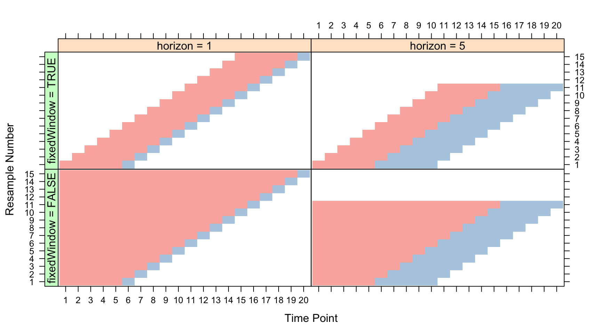

```{r setup, include=FALSE}
knitr::opts_chunk$set(echo = TRUE)
```

As of December 1st, 2016, the forecasting extension of mlr is under code review and is a branch of the development version of mlr. You can download this branch through the `githubinstall` package.

```{r getforemlr, eval = FALSE}
library(githubinstall)
gh_install_packages("mlr-org/mlr", ref = "forecasting")
```

## Forecasting

The standard objective in forecasting is, at time period $t$, make predictions for $t+h$ periods into the future. Forecasting tasks are most suitable when past patterns in the data will continue on into the future. While R has many wonderful packages for forecasting, there is no package on CRAN that gives users a standardized form for forecasting models, such as `mlr` and `caret` for machine learning models. The purpose of this package extension is to give users of `mlr` the opportunity to safely and productively train, optimize, and deploy forecasting models.

## Forecasting Tasks

For our purposes we will simulate some data.

```{r makedata, cache = TRUE}
set.seed(1234)
dat = arima.sim(model = list(ar = c(.5,.2), ma = c(.4), order = c(2,0,1)), n = 200)
times = (as.POSIXlt("1992-01-14")) + lubridate::days(1:200)
dat = xts::xts(dat,order.by = times)
colnames(dat) = c("arma_test")
```

To specify a forecast task we must pass an `xts` object containing the data, a `target`, and the `frequency` of the data. The frequency of the data can be thought of as the seasonality. For example, a frequency of seven on daily data would be a weekly seasonality. A frequency of fifty-two on weekly data would indicate a yearly seasonality.

```{r makeTask, cache = TRUE}
library(mlr)
fcregr.task = makeForecastRegrTask(id = "test", data = dat, target = "arma_test",
                                     frequency = 7L)
fcregr.task
```


Like a regression task, this records the type of the learning problem and basic information about the data set. This task also returns the start and end dates of the time series as well as the frequency.

## Multivariate Forecasting Tasks

One common problem with forecasting is that it is difficult to use additional explanatory variables or forecast multiple targets that are dependent on one another. If we are at time $t$ and want to forecast 10 periods in the future, we need to know the values of the explanatory variables at time $t+10$, which is often not possible. A new set of models which treats explanatory variables endogenously instead of exogenously allows us to forecast not only our target, but addititional explanatory variables. This is done by treating all the variables as targets, making them endogeneous to the model. To use these models, we create a multivariate forecasting task.

```{r EuStockData, cache = TRUE}
data("EuStockMarkets")
EuStockMarkets.time = lubridate::date_decimal(as.numeric(time(EuStockMarkets)))
EuStockMarkets  = xts::xts(as.data.frame(EuStockMarkets), order.by = EuStockMarkets.time)

mfcregr.task = makeMultiForecastRegrTask(id = "bigvar", data = EuStockMarkets, target = "all", frequency = 7L)
mfcregr.task
```

This task prints the same information as a univariate forecast task.

If we would like to specify a target variable while still forecasting the rest of the data in an endogenous manner, we change our target to one of the variables.

```{r EuStockDataSingle, cache = TRUE}
mfcregr.task = makeMultiForecastRegrTask(id = "bigvar", data = EuStockMarkets, target = "DAX", frequency = 7L)
mfcregr.task
```

## Making Learners for Forecasting

We create an arima model from the package `forecast` using `makeLearner()` by calling the learner class `fcregr.Arima`. An important parameter is the `h` parameter, which is used to specify that we are forecasting 10 periods ahead.

```{r makeArima, cache = TRUE}
arm = makeLearner("fcregr.Arima", order = c(2L,0L,1L), h = 10L, include.mean = FALSE)
arm
```

On a side note, the only forecasting models that support using additional regressors are `Arima` and `auto.arima`. For these models, the additional variables in our tasks data set will be assumed to be the extra regressors. For all other forecasting models only the target will be used and the rest will be ignored. 

## Resampling

mlr now has two new cross validation resampling strategies, `GrowingCV` and `FixedCV`. They are both rolling forecasting origin techniques established in Hyndman and Athanasopoulos (2013) and first widely available for machine learning in R by the `caret` package’s `createTimeSlices()` function. We specify:

1. horizon - the number of periods to forecast
2. initial.window - The proportion of data that will be used in the initial window
3. size - The numberof rows in the training set
4. skip - the proportion of windows to skip over, which can be used to save time

```{r resampleDescSimp, cache = TRUE}
resamp.desc = makeResampleDesc("GrowingCV", horizon = 10L,
                               initial.window = .90,
                               size = nrow(getTaskData(fcregr.task)), skip = .01)
resamp.desc
```

Note that we should not specify stratification, as it does not really make sense in the context of time series to stratify our data (unless a future impliementation can somehow use this for panel data). The wonderful graphic posted below comes from the `caret` package's website and gives an intuitive idea of the sliding windows for both the growing and fixed options.



## Forecasting Models

Several new models have been included from the `forecast` package and well as `rugarch`:

1. Exponential smoothing state space model with Box-Cox transformation (bats)
2. Exponential smoothing state space model with Box-Cox transformation, ARMA errors, Trend and Seasonal Fourier components (tbats)
3. Exponential smoothing state space model (ets)
4. Neural Network Autoregressive model (nnetar)
5. Automated Arima (auto.arima)
6. General Autoregressive Conditional Heteroskedasticity models (GARCH)
7. BigVar for multivariate time series

These all operate the same as the other models in mlr, with a very important parameter. Models will either have an `h` or `n.ahead` parameter, which is the number of periods you want to forecast into the future. Note that this should be equal to the horizon you set in your growing or fixed window resampling strategy.

```{r garchMod, cache = TRUE}
garchMod = makeLearner("fcregr.garch", model = "sGARCH",
                       garchOrder = c(1,1), n.ahead = 10,
                       armaOrder = c(2, 1))
m = train(garchMod, fcregr.task)
predict(m,task = fcregr.task)
```

## Tuning

The forecasting features fully integrate into mlr, allowing us to also make a parameter set to tune over. Here we tune an ARIMA model and with F1-racing used to tune our parameters.

```{r tuneArima, cache = TRUE}
par_set = makeParamSet(
  makeIntegerVectorParam(id = "order",
                         len = 3L,
                         lower = 0,
                         upper = 2,
                         tunable = TRUE),
  makeLogicalParam(id = "include.mean", default = FALSE, tunable = TRUE)
  )

#Specify tune by grid estimation
ctrl = makeTuneControlIrace(maxExperiments = 180L)

configureMlr(on.learner.error = "warn")
res = tuneParams(makeLearner("fcregr.Arima",h=10), task = fcregr.task, resampling = resamp.desc, par.set = par_set, control = ctrl, measures = mase, show.info = FALSE)
res
```

Once we have tuned the model we get back the hyperparameters of the best model through `setHyperPars()` and then train the model like any other.

```{r bestArima, cache = TRUE}
lrn = setHyperPars(makeLearner("fcregr.Arima"), par.vals = res$x)
m.best = train(lrn, fcregr.task)
m.best
predict(m.best, task = fcregr.task)
```

## Updating Models

A new function `updateModel()` has been implimented that updates the model given new data. This function is currently only implimented for ets, Arima, auto.arima, bats, tbats, and nnetar.

```{r updateArima, cache = TRUE}
fcregr.task = makeForecastRegrTask(id = "test", data = dat[1:190,], target = "arma_test",
                                     frequency = 7L)
arm = makeLearner("fcregr.Arima", order = c(2L,0L,1L), h = 10L, include.mean = FALSE)
arm
armMod = train(arm, fcregr.task)
updateArmMod = updateModel(armMod, fcregr.task, newdata = dat[191:200,])
updateArmMod
```

This works by making a call to `updateLearner.fcregr.Arima()` and updating the model and task data with newdata. `predict()` works as it would on a normal model.

## Pre-processing
### Creating Lags and Differences

The function `createLagDiffFeatures()` allows users to create arbitrary lags and differences of their task data.

```{r createlagdiff, cache = TRUE}
fcregr.task.lag = createLagDiffFeatures(fcregr.task,lag = 2L:4L, difference = 1L, 
                                          seasonal.lag = 1L:2L)
tail(fcregr.task.lag$env$data)
fcregr.task.lag
```

This can be used with any task type as long as the row names of the task data can be converted to `POSIXct` format. 

As an example, we will build and train a gradient boosting machine using lagged data.

```{r gdmLags, cache = TRUE}
regr.task = makeRegrTask(id = "Lagged ML model", data = as.data.frame(dat), target = "arma_test")
regr.task.lag = createLagDiffFeatures(regr.task, lag = 1L:10L, difference = 0L)

regrGbm <- makeLearner("regr.gbm", par.vals = list(n.trees = 100))
gbmMod = train(regrGbm, regr.task.lag)
```

To forecast with a regression model whose task is manipulated by `createLagDiffFeatures()` use the function `forecast()`.

```{r forecastgbm, cache = TRUE}
forecast(gbmMod, h = 10)
```

## Classification Forecasting Example

For developing trading strategies, we normally have a set of 
```{r binaryforecast, cache = TRUE}
library(xts)
library(lubridate)
set.seed(1234)
dat  = arima.sim(model = list(ar = c(.8,.1), ma = c(.4), order = c(2,0,1)), n = 300)
jump = data.frame(jump = ifelse(diff(dat) > .5, "Buy",ifelse(diff(dat) < -.5, "Sell","Hold")))
times = (as.POSIXct("1992-01-14")) + lubridate::days(1:299)
rownames(jump) = times

classif.task = makeClassifTask(data = jump,target = "jump")
classif.task = createLagDiffFeatures(classif.task, lag = 1L:15L, 
                                     na.pad = FALSE)

classif.learn = makeLearner("classif.boosting")
classif.train = train(classif.learn,classif.task)
forecast(classif.train, h = 10)
```

## Lambert W Transforms

A new preprocessing wrapper `makePreprocWrapperLambert()` has been added. This function uses the `LambertW` package’s `Guassianize()` function to help remove skewness and kurtosis from the data.

```{r lambertclassif, cache = TRUE}
lrn = makePreprocWrapperLambert("classif.lda", type = "h")
print(lrn)
train(lrn, iris.task)
```

The largest benefit of this preprocessing scheme is that it, as the function says, "Guassianizes" the data in a similar manner to Box-Cox transforms. Many machine learning and forecasting models lean on the assumption that our data is normally distributed and this preprocessing feature allows us to coalesce the data to fit that assumption.
## Ensemble’s of Forecasts

It’s known that ensembles of forecasts tend to outperform standard forecasting techniques. Here we use mlr’s stacked modeling functionality to ensemble multiple forecast techniques.

```{r forecastBlend, cache = TRUE}
# Create some data
library(xts)
library(lubridate)
dat = arima.sim(model = list(ar = c(.5,.2), ma = c(.4), order = c(2,0,1)), n = 500)
times = (as.POSIXlt("1992-01-14")) + lubridate::days(1:500)
dat = xts(dat,order.by = times)
colnames(dat) = c("arma_test")

# seperate into test and train
dat.train = dat[1:490,]
dat.test  = dat[491:500,]

fcregr.task = makeForecastRegrTask(id = "test", data = dat.train, target = "arma_test",
                                     frequency = 7L)
                                     
resamp.sub = makeResampleDesc("GrowingCV",
                          horizon = 10L,
                          initial.window = .90,
                          size = nrow(getTaskData(fcregr.task)),
                          skip = .01
                          )
                          
resamp.super = makeResampleDesc("CV", iters = 5)

lrns = makeLearners(c("fcregr.tbats","fcregr.garch"))

                            
stack.forecast = makeStackedLearner(base.learners = lrns,
                       predict.type = "response",
                       method = "average")

# Simple param set for tuning sub learners
ps = makeParamSet(
  makeDiscreteParam("fcregr.tbats.h", values = 10),
  makeDiscreteParam("fcregr.garch.n.ahead", values = 10)
)

## tuning
fore.tune = tuneParams(stack.forecast, fcregr.task, resampling = resamp.sub,
                   par.set = ps, control = makeTuneControlGrid(),
                   measures = mase, show.info = FALSE)
fore.tune
# get hyper params
stack.forecast.tune  = setHyperPars2(stack.forecast,fore.tune$x)
stack.forecast.tune
# Train the final best models and predict
stack.forecast.mod = train(stack.forecast.tune,fcregr.task)
stack.forecast.pred = predict(stack.forecast.mod, newdata = dat.test)
stack.forecast.pred
```

# Multivariate Forecasting with ML stacking

One difficulty in the integration of machine learning and forecasting is that most machine learning models rely on a large amount of exogeneous data to derive good answers. As stated before, since we can't forecast these exogeneous variables it becomes difficult to fully use the power of machine learning models. One workaround to this is to use mlr's ensembling method to build a multivariate forecaster, targeting a specific variable, and then training a machine learning model on the forecasts of all variables. It works as the following

1. Make a multivariate task, targeting the chosen variable
2. Create a stacked learner, whose base learner is a `mfcregr.BigVAR` model
3. Create a super learner, which will be trained on the 'stacked' learner
4. Tune and train the stacked learner
5. Tune and train the super learner on the forecasts produced by the stacked learner

And now your final model you use for prediction will first forecast your extra variables and then use those forecasts to forecast the final values for the target variable.

```{r multivarStack, cache = TRUE}
EuStockMarkets.train = EuStockMarkets[1:1855,]
EuStockMarkets.test = EuStockMarkets[1856:1860,]
multfore.task = makeMultiForecastRegrTask(id = "bigvar", data = EuStockMarkets.train, target = "FTSE")

resamp.sub = makeResampleDesc("GrowingCV",
                              horizon = 5L,
                              initial.window = .97,
                              size = nrow(getTaskData(multfore.task)),
                              skip = .01
)

resamp.super = makeResampleDesc("CV", iters = 3)

base = c("mfcregr.BigVAR")
lrns = lapply(base, makeLearner)
lrns = lapply(lrns, setPredictType, "response")
lrns[[1]]$par.vals$verbose = FALSE
stack.forecast = makeStackedLearner(base.learners = lrns,
                                    predict.type = "response",
                                    super.learner = makeLearner("regr.earth", penalty = 2),
                                    method = "growing.cv",
                                    resampling = resamp.sub)

ps = makeParamSet(
  makeDiscreteParam("mfcregr.BigVAR.p", values = 5),
  makeDiscreteParam("mfcregr.BigVAR.struct", values = "Basic"),
  makeNumericVectorParam("mfcregr.BigVAR.gran", len = 2L, lower = 25, upper = 26),
  makeDiscreteParam("mfcregr.BigVAR.h", values = 5),
  makeDiscreteParam("mfcregr.BigVAR.n.ahead", values = 5)
)

## tuning
multfore.tune = tuneParams(stack.forecast, multfore.task, resampling = resamp.sub,
                   par.set = ps, control = makeTuneControlGrid(),
                   measures = multivar.mase, show.info = FALSE)
multfore.tune
stack.forecast.f  = setHyperPars2(stack.forecast,multfore.tune$x)
multfore.train = train(stack.forecast.f,multfore.task)
multfore.train
multfore.pred = predict(multfore.train, newdata = EuStockMarkets.test)
multfore.pred
performance(multfore.pred, mase, task = multfore.task)
```